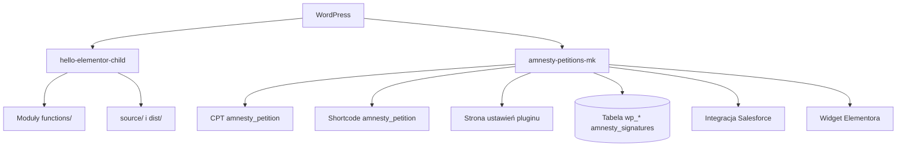

# Architektura

## Zakres

Opisywany system składa się z motywu potomnego WordPressa i własnego pluginu do obsługi petycji. Kod działa w istniejącej instalacji WordPressa pod `wp-content`.

## Punkty wejścia

### Motyw

Głównym punktem wejścia jest [`themes/hello-elementor-child/functions.php`](../themes/hello-elementor-child/functions.php). Plik:

1. definiuje `MARATON_VERSION`;
2. ładuje klasę rozszerzenia Elementora;
3. dołącza moduły z katalogu `functions/`;
4. tworzy instancję `Maraton\\Maraton_Elementor_Extension`.

### Plugin

Punktem wejścia jest [`plugins/amnesty-petitions-mk/amnesty-petitions.php`](../plugins/amnesty-petitions-mk/amnesty-petitions.php). Plugin definiuje ścieżki i wersję, a następnie ładuje moduły odpowiedzialne za bazę danych, CPT, ustawienia, shortcode’y, AJAX, administrację podpisami, widget Elementora i template tags.

## Granice modułów

## Główne przepływy

### Pojedyncza petycja

1. WordPress rozpoznaje wpis typu `amnesty_petition`.
2. Plugin przez filtr `single_template` wybiera szablon [`templates/single-amnesty_petition.php`](../plugins/amnesty-petitions-mk/templates/single-amnesty_petition.php), jeśli motyw nie dostarcza override’u.
3. Szablon renderuje hero, dane wpisu, opis i formularz shortcode’em `amnesty_petition`.
4. Shortcode pobiera treść listu z meta wpisu i konfigurację globalną z opcji WordPressa.
5. Formularz wysyła dane AJAX-em do `admin-ajax.php`.
6. Obsługa AJAX zapisuje podpisy w tabeli `{$wpdb->prefix}amnesty_signatures` i może przekazać dane do Salesforce.
7. Po sukcesie frontend przechodzi do stanu `#thankyou`, który pokazuje ekran podziękowania.

### Logowanie użytkownika

Motyw rejestruje shortcode `event_login`. Formularz jest obsługiwany lokalnie przez `wp_signon()`. Po sukcesie następuje przekierowanie do `/panel/`; po błędzie formularz pozostaje na stronie i pokazuje komunikat.

### Wydarzenia i panel

Moduły motywu rejestrują własny CPT `wydarzenie`, formularze wydarzeń, mapę, panel użytkownika, materiały, raporty i integrację wysyłkową. Szczegóły znajdują się w dokumentacji motywu.

## Kontrakty danych

- Opcje globalne: `get_option()` / `register_setting()`.
- Dane pojedynczej petycji: meta wpisu, m.in. `_amnesty_petition_target`, `_amnesty_petition_extra_letters`, `_amnesty_petition_appeal` i `_amnesty_petition_solidarity_letter`.
- Podpisy: tabela WordPressa z nazwą budowaną przez `$wpdb->prefix . 'amnesty_signatures'`.
- Żądania formularza: AJAX przez `admin-ajax.php`, nonce `amnesty_sign_petition`.
- Zasoby motywu: źródła SCSS/JS w `source/`, artefakty frontendowe w `dist/`.

## Ograniczenia

- Brak testów automatycznych i CI w tym repozytorium.
- Część CSS jest utrzymywana jako ręczny CSS pluginu, a część jako SCSS motywu oraz wygenerowany `dist`.
- Integracja Salesforce zależy od konfiguracji środowiska i zewnętrznego API.
- Aktualne zmiany robocze nie są jeszcze częścią ostatniego commita.
